<picture>
  <source media="(prefers-color-scheme: light)" srcset="banner-light.svg">
  <source media="(prefers-color-scheme: dark)" srcset="banner-dark.svg">
  
</picture>

<div align="center">


</div>

<br/>

---

## 🪪 About Me

<table align="center" border="0">
<tr>
<td width="38%" align="center" valign="middle">



</td>
<td width="62%" valign="top">

```yaml
name: Thuyavan M
role: MERN Stack Developer & CSE Undergraduate
education: B.E. Computer Science & Engineering
college: University College of Engineering, Kanchipuram
duration: 2023 – 2027
cgpa: 8.21 / 10.0
location: Sholinghur, Tamil Nadu, India
highlight: "1st Prize — Kings Engg College Expo (beat 20+ teams)"
currently_learning: [Redux Toolkit, NestJS, OAuth 2.0, Jest, AWS]
```

- 💼 Full-Stack Developer Intern @ **IVW Private Limited**, Chennai
- 🔐 Secure Web Application Intern @ **Approtech**, Tambaram
- 🤖 Engineered a **Gemini API–powered detection pipeline** classifying AI vs human content in **under 2 seconds**
- 🌐 Ship MERN apps with **JWT auth, RBAC middleware, RESTful APIs**, deployed live on **Vercel & Render**
- 📫 **thuyavan855@gmail.com**

> 💬 *"I don't just build apps — I ship them to production."*

</td>
</tr>
</table>

<br/>

---

## 🚀 Featured Projects

| Project | Description | Stack |
|:--------|:------------|:-----:|
| 🧠 **Fake Content Detection System** | **1st Prize** among 20+ teams — 7-module LLM pipeline classifying AI-generated vs human text in **< 2s** via prompt-engineered Gemini API chains | `React` `Node.js` `TypeScript` `Gemini API` `Express.js` |
| 📊 **Algorithm Visualisation App** | Interactive platform covering **25+ sorting / searching / graph algorithms** with real-time, colour-coded step animations — used by 30+ peers | `React` `TypeScript` `Chart.js` `Vercel` |
| 💸 **Full-Stack Expense Tracker** | Live MERN app with JWT auth lifecycle, RBAC route protection, 6 RESTful CRUD endpoints, Chart.js dashboards | `React` `Node.js` `Express` `MongoDB` `PostgreSQL` `JWT` |

<div align="center">
<a href="https://github.com/Thuyavan28?tab=repositories">
  
</a>
</div>

<br/>

---

## 🧰 Tech Stack

<div align="center">

**Languages**


**Frontend & Mobile**


**Backend**


**Databases**


**AI / LLM**


**System Design & Architecture**


**Testing**


**DevOps & Tools**


<br/>


</div>

<br/>

---

## 💼 Experience

**IVW Private Limited, Chennai** · *Full-Stack Developer Intern* · Jul 2025

Architected 3 React.js frontend modules integrated with 7 Node.js/Express REST endpoints on MySQL. Shipped all 3 to production within a 4-week sprint; maintained a 100% clean-merge record across a 4-engineer Agile team.

**Approtech, Tambaram** · *Secure Web Application Intern* · Jun – Jul 2026

Identified and documented 8+ vulnerabilities (XSS, broken auth, open ports) across 2 client environments using Burp Suite, OWASP ZAP, and Nmap. Produced OWASP Top 10–aligned remediation reports.

<br/>

---

## 🎓 Education

| Institution | Degree | Period | Score |
|:------------|:-------|:------:|:-----:|
| University College of Engineering, Kanchipuram | B.E. Computer Science & Engineering | 2023 – 2027 | **8.21 CGPA** |
| Sri Ayyan Vidhyasharam Hr. Sec. School | Higher Secondary (Class XII) | 2023 | **86.5%** |

<br/>

---

## 🧭 Currently

```text
🔭 Working on:   Production MERN + Flutter apps with LLM-powered features
🌱 Learning:     Redux Toolkit · NestJS · OAuth 2.0 · Jest · AWS · Flutter
🤝 Open to:      Full-Stack / SDE / Mobile Internships & Collaborations
💬 Ask me about: React, Node.js, Flutter, System Design, Gemini API
⚡ Fun fact:     I turn coffee ☕ into commits 🚀
```

<br/>

---

## 📊 GitHub Stats

<div align="center">

<picture>
  <source media="(prefers-color-scheme: light)" srcset="./banner-light.svg">
  <source media="(prefers-color-scheme: dark)" srcset="./banner-dark.svg">
  
</picture>

<br/>

<picture>
  <source media="(prefers-color-scheme: dark)" srcset="https://streak-stats.demolab.com/?user=Thuyavan28&hide_border=true&background=0D1117&stroke=334155&ring=2563EB&fire=2563EB&currStreakLabel=2563EB&sideLabels=94A3B8&currStreakNum=F8FAFC&sideNums=F8FAFC&dates=64748B&card_width=1180"/>
  
</picture>

<br/><br/>

<picture>
  <source media="(prefers-color-scheme: dark)" srcset="https://github-readme-stats.vercel.app/api?username=Thuyavan28&show_icons=true&count_private=true&include_all_commits=true&hide_border=true&title_color=2563EB&icon_color=2563EB&text_color=c9d1d9&bg_color=0d1117&card_width=500"/>
  
</picture>
<picture>
  <source media="(prefers-color-scheme: dark)" srcset="https://github-readme-stats.vercel.app/api/top-langs/?username=Thuyavan28&layout=compact&langs_count=8&hide_border=true&title_color=2563EB&text_color=c9d1d9&bg_color=0d1117&card_width=500"/>
  
</picture>

<br/><br/>

<picture>
  <source media="(prefers-color-scheme: dark)" srcset="https://github-readme-activity-graph.vercel.app/graph?username=Thuyavan28&bg_color=0d1117&color=94A3B8&line=2563EB&point=ffffff&area=true&area_color=2563EB&hide_border=true&custom_title=Contribution%20Activity"/>
  
</picture>

<br/><br/>

<picture>
  <source media="(prefers-color-scheme: dark)" srcset="https://github-profile-trophy.vercel.app/?username=Thuyavan28&theme=onestar&no-frame=true&row=1&column=7&margin-w=8"/>
  
</picture>

</div>

<br/>

---

## 🐍 Contribution Snake

<div align="center">

<picture>
  <source media="(prefers-color-scheme: dark)" srcset="https://raw.githubusercontent.com/Thuyavan28/Thuyavan28/output/github-contribution-grid-snake-dark.svg">
  <source media="(prefers-color-scheme: light)" srcset="https://raw.githubusercontent.com/Thuyavan28/Thuyavan28/output/github-contribution-grid-snake.svg">
  
</picture>

</div>

> ⚙️ **To activate the snake:** Add this GitHub Actions workflow to your repo at `.github/workflows/snake.yml`:
>
> ```yaml
> name: Generate Snake
> on:
>   schedule:
>     - cron: "0 0 * * *"
>   workflow_dispatch:
> jobs:
>   generate:
>     runs-on: ubuntu-latest
>     steps:
>       - uses: Platane/snk/svg-only@v3
>         with:
>           github_user_name: Thuyavan28
>           outputs: |
>             dist/github-contribution-grid-snake.svg
>             dist/github-contribution-grid-snake-dark.svg?palette=github-dark
>       - uses: crazy-max/ghaction-github-pages@v3
>         with:
>           target_branch: output
>           build_dir: dist
>         env:
>           GITHUB_TOKEN: ${{ secrets.GITHUB_TOKEN }}
> ```

<br/>

---

## 🏆 Achievements & Certifications

- 🥇 **1st Prize — Project Expo, Kings Engineering College (2026)** — Fake Content Detection System, beat 20+ teams
- 🧩 **Hackathons:** ByteBlaze (SIMATS Engineering) · QUANT-A-THON '26 · HackWithChennai
- 📜 **Certifications:** AI-Powered Full Stack Development · Prompt Engineering · DSA 21-Day Challenge · Big Data & Scala · C Programming
- 🗣️ **Languages:** English (Professional) · Tamil (Native)

<br/>

---

## 📫 Connect

<div align="center">

<a href="https://www.linkedin.com/in/thuyavan-m-596174355/">
  
</a>
&nbsp;
<a href="https://github.com/Thuyavan28/">
  
</a>
&nbsp;
<a href="https://thuyavan-portfoli.netlify.app/">
  
</a>
&nbsp;
<a href="mailto:thuyavan855@gmail.com">
  
</a>

<br/><br/>


<br/><br/>

**Always learning. Always building.**

</div>
